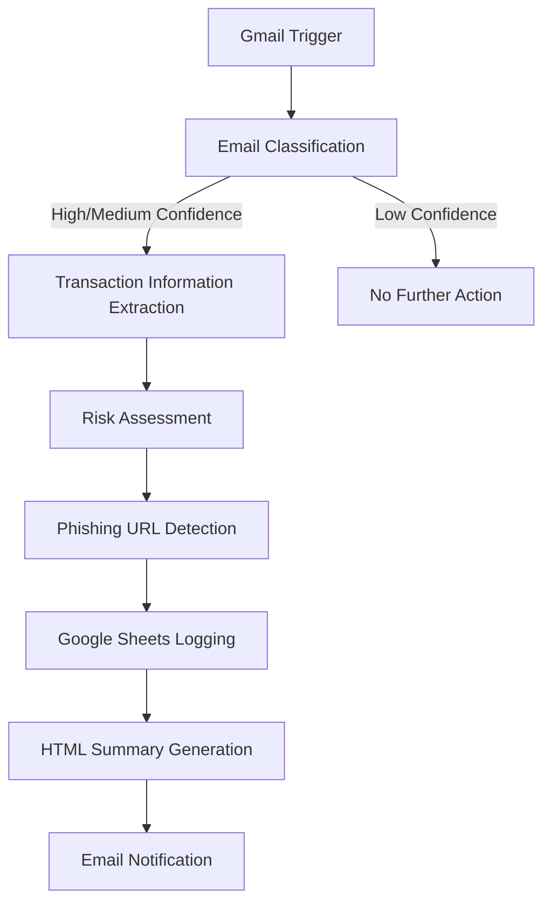
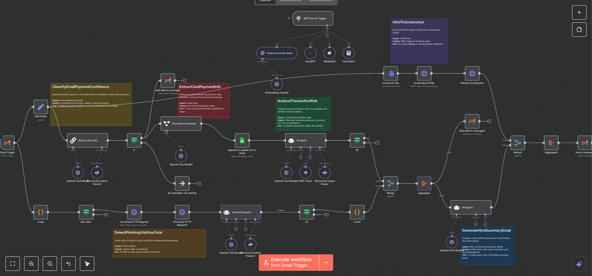

# 🕵️ Fraud Detection Email Workflow

## Overview
This n8n workflow is a sophisticated automated system for detecting and analyzing potentially fraudulent credit card transactions and phishing emails using advanced AI technologies.

## Workflow Visualization

## 🔍 Key Components

### 1. Workflow Trigger
- **Gmail Trigger**: 
  - Monitors incoming emails in specific Gmail labels
  - Polls emails every minute
  - Focuses on emails in INBOX and a specific custom label

### 2. Fraud Detection Process

#### 🏷️ Email Classification
- Uses OpenAI's GPT-4o-mini model to analyze email content
- Classifies emails into confidence levels:
  - 🔴 High: Clearly a credit card payment
  - 🟠 Medium: Possibly payment-related
  - 🟢 Low: Not payment-related

#### 📊 Transaction Information Extraction
- Extracts key transaction details using AI:
  - Payment amount
  - Transaction date
  - Merchant name
  - Payment method
  - Last 4 digits of credit card

#### 🔬 Risk Assessment
- Leverages multiple AI tools for comprehensive analysis:
  - Pinecone Vector Store for historical transaction comparison
  - SerpAPI and Wikipedia for merchant verification
  - Custom AI agent for detailed risk evaluation

#### 🚨 Phishing Detection
- Uses VirusTotal API to scan URLs in the email
- Determines if email contains potential phishing links

### 📤 Output and Notification
- Appends transaction details to a Google Sheet
- Generates a detailed HTML summary
- Sends an email with transaction analysis and screenshot

## 🛠 Technologies Used
| Technology | Purpose |
|-----------|---------|
| n8n Workflow Automation | Workflow orchestration |
| OpenAI (GPT-4o-mini) | AI-powered analysis |
| Gmail API | Email retrieval |
| Google Sheets API | Transaction logging |
| Pinecone Vector Store | Historical transaction comparison |
| VirusTotal API | URL safety scanning |
| SerpAPI | Merchant information retrieval |
| Wikipedia API | Additional merchant verification |

## 🔄 Workflow Steps
1. 📧 Retrieve email from Gmail
2. 🏷️ Classify email payment potential
3. 📊 Extract transaction details
4. 🔬 Perform risk assessment
5. 🚨 Check for phishing URLs
6. 📝 Log transaction to Google Sheet
7. 📄 Generate summary email
8. 📤 Send notification

## 🛡️ Security Features
- Multi-layered AI-powered fraud detection
- URL safety scanning
- Merchant verification
- Historical transaction comparison

## 🔧 Customization
The workflow can be easily modified to:
- Add more detection rules
- Change confidence thresholds
- Adjust notification methods

## 📋 Prerequisites
- Gmail account
- OpenAI API key
- VirusTotal API key
- Google Sheets access
- Pinecone Vector Store setup
- Hcti API key